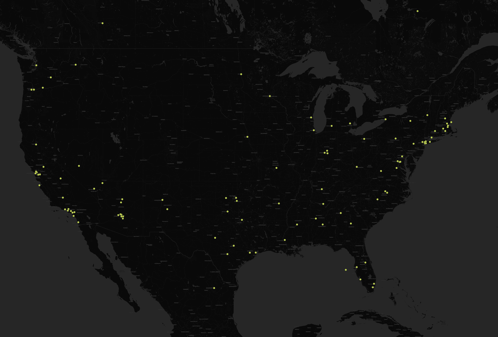
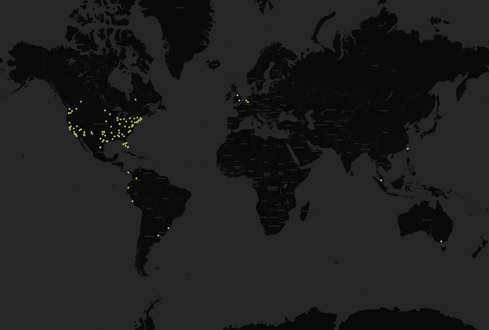

# Tweet Map
## Geography 458 Lab 2

I set the geo search crawler to run for 30 minutes and filter tweets using the keyword 'biden.' The program logged roughly 170 tweets that contained geodata. I was surprised to see just how few people allow twitter to access their location data. One would figure that Joe Biden would be named in thousands of tweets per day from accounts with location data like news outlets etc. I tried multiple keywords for popular topics that get thousands of tweets every day, and each time I only ened up with a handful of logged tweets. Luckily, Joe Biden came through with a dataset large enough to make a map interesting.

## Map of Tweets Containing Keyword 'Biden', USA

Although there is not much data, some patterns seem to be evident. Most of the activity is clustered around California and the East Coast. Additionally, the Midwest is nearly empty and the South is sparsely populated. This makes sense: the coasts are the most densely populated areas of the country and people there are more likely to use twitter. 

## Map of Tweets Containing Keyword 'Biden', World

 In a map of world tweets about 'biden,' one would expect to see some tweets from the UK or other parts of Western Europe and Australia. Interestingly, a number of tweets from various South American countries were logged, which is not something that I expected from the results.
